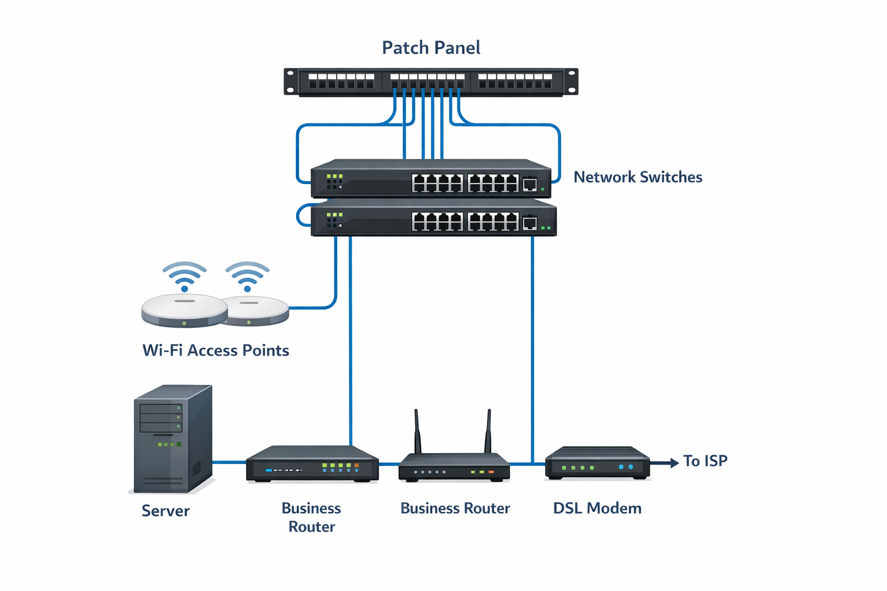

---

### Topic 2: Physical Network Infrastructure

- 📖 [Theory & Cable Analysis](Topic-2-Physical-Network-Infrastructure/README.md)
- 🔌 [UTP vs STP Comparison](Topic-2-Physical-Network-Infrastructure/UTP-vs-STP.md)
- 🛠 [Infrastructure Upgrade Lab](Topic-2-Physical-Network-Infrastructure/Patching-Lab.md)

---

## 📌 Overview

In this topic, I moved beyond theoretical networking concepts and focused on the physical components that make communication possible.

While Topic 1 explored how data moves logically through layers, this topic focuses on what actually connects everything together — cables, switches, patch panels, routers, and access points.

Understanding both physical and logical layouts is essential for designing reliable networks.
---

## 🖼 Physical Network Layout Example

This diagram represents a structured small business network. 

Unlike a simple SOHO router setup, this design separates infrastructure into dedicated components:

- Patch panels for cable management  
- Switches for internal traffic  
- Access points for wireless connectivity  
- Routers for WAN routing  
- Modems for ISP connectivity  

This structured approach improves scalability, reliability, and organization.

---

## 🎯 Objectives

By completing this topic, I learned to:

- Describe LAN connection mediums (copper and fiber)
- Compare Ethernet standards used in modern businesses
- Explain the core technologies behind data communication
- Configure and patch physical network devices
- Transition from a SOHO setup to small business infrastructure

---

## 📂 Topic Sections

- 📖 [UTP vs STP Cable Analysis](UTP-vs-STP.md)
- 🛠 [Packet Tracer Part 2: Patching & Infrastructure Upgrade](Patching-Lab.md)

