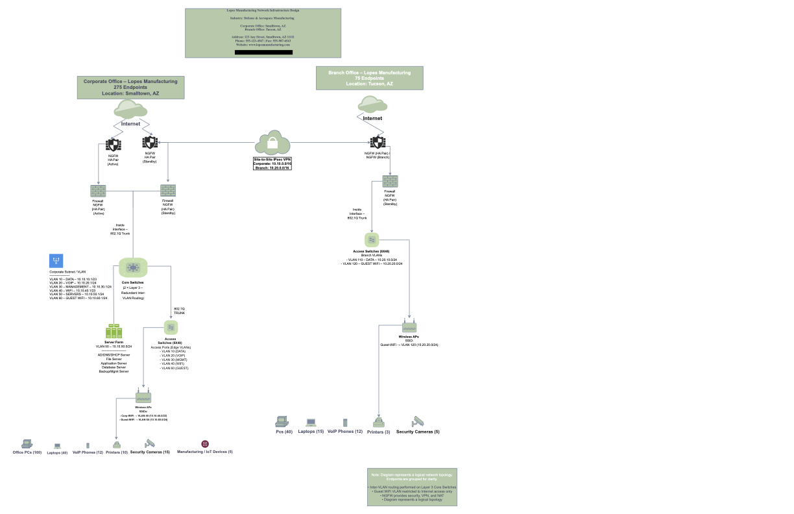

# 🏢 Network Design Phase 2: Routing, VLANs, and Subnets

---

## 📌 Project Overview

In this phase, I expanded a previously designed network for a company with:

- A corporate office (275 devices)
- A branch office (75 devices)

The goal was to design a scalable, secure, and properly segmented network using:

- Routing
- VLANs
- IPv4 subnetting
- Firewalls
- Server infrastructure

---

## 🏗 Designing for Growth and Security

To support 275 endpoints at corporate and 75 at the branch, the design required:

- Layer 3 routing devices to manage internal and external traffic
- Next-generation firewalls (NGFW) for security
- Proper VLAN segmentation
- Fault tolerance at the corporate location

Instead of putting everything on one large network, VLANs were used to logically separate traffic.

---

## 🗂 VLAN Structure

### Corporate VLANs:
- DATA
- VOIP
- MANAGEMENT
- WIFI
- GUEST WIFI

### Branch VLANs:
- DATA
- GUEST WIFI

Each VLAN was assigned a private IPv4 subnet using CIDR notation.

For example:

- 10.10.10.0/24 – Corporate DATA
- 10.10.20.0/24 – Corporate VOIP
- 10.20.10.0/25 – Branch DATA

Using CIDR notation allows flexibility and scalability.

---

## 🔁 Routing and Core Infrastructure

At the corporate office:

- Core switches aggregated access switches
- Routing enabled communication between VLANs
- Firewalls protected internal networks
- Servers were connected to the core layer

This design followed best practices:

- Access Layer (end devices)
- Distribution/Core Layer (routing and aggregation)
- Security Layer (firewalls)

---

## 📷 Network Diagram (Phase 2)

---

## 💭 Reflection

This phase helped me understand how real enterprise networks are structured.

It is not just about connecting devices.

It is about:
- Segmenting traffic
- Controlling communication
- Planning for growth
- Maintaining security

