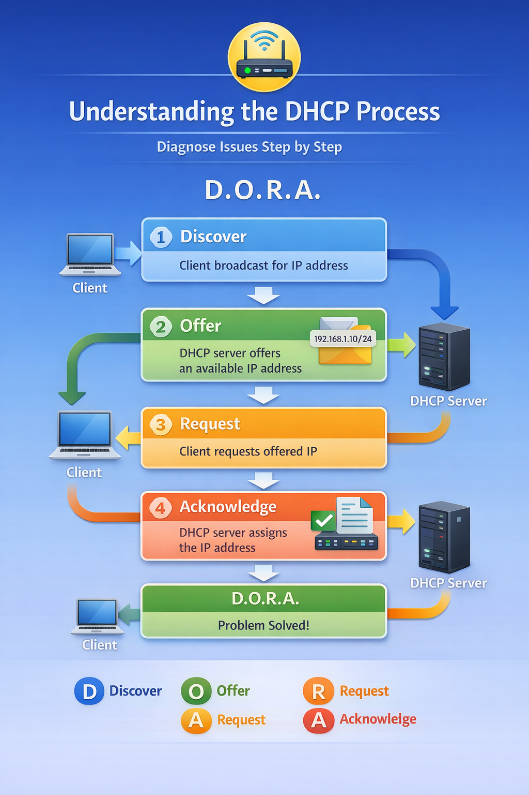
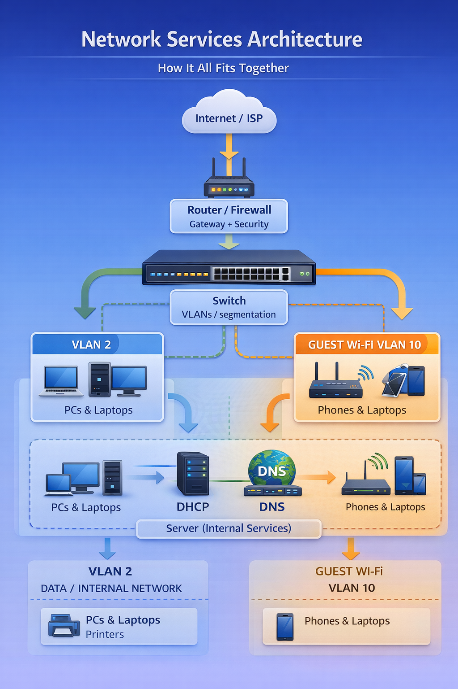

# 🔐 Topic 6: Network Services, Security, & Troubleshooting

---

## 📖 Quick Navigation

- [Troubleshooting Framework](#-osi-based-troubleshooting-framework)
- [DHCP Process (DORA)](#-understanding-the-dhcp-process-dora)
- [Network Services Architecture](#-network-services-architecture-how-it-all-fits)
- [Cybersecurity Threat Breakdown](#-common-cybersecurity-threats)
- [Command-Line Toolkit](#-network-troubleshooting-command-line-toolkit)
- [Related Work](#-related-work)
- [Final Reflection](#-final-reflection)

---
> 📌 This topic explores how modern networks deliver core services, defend against cybersecurity threats, and resolve connectivity issues using structured troubleshooting.

- 📖 [Overview](Topic-6-Network-Services-Security-Troubleshooting/README.md)

---

## 📌 Overview

In this topic, I moved beyond basic network structure and began focusing on the services and security mechanisms that keep networks operational and protected.

While earlier topics explored how networks are built, this topic focused on:

- How devices receive IP addresses
- How domain names resolve to IP addresses
- How administrators troubleshoot connectivity
- How organizations protect infrastructure from cyber threats

This topic connects technical configuration with security awareness and real-world troubleshooting strategy.
---

## 🧭 Big Idea of This Topic

If networking is “getting devices connected,” then **services and security** are what make the network usable and trustworthy.

- **DHCP** answers: “How does a device get an IP?”
- **DNS** answers: “How do names turn into IP addresses?”
- **Troubleshooting** answers: “How do I find what’s broken?”
- **Security** answers: “How do I keep this stable and safe?”

---

## 🎯 Learning Objectives

- Identify core network infrastructure devices and their roles
- Understand common network services such as DHCP, DNS, and NTP
- Explore cybersecurity partnerships and defense frameworks
- Apply the OSI model to troubleshoot connectivity issues
- Use command-line tools to verify network health
---

## 📖 Quick Navigation

- 🔄 Troubleshooting Framework
- 🌐 DHCP (DORA) Process
- 🛡 Cybersecurity Threats
- 🧰 Command-Line Toolkit
- 🖥 Packet Tracer Lab

---

## 🔄 Visual Troubleshooting Framework

The OSI model becomes most powerful when used as a structured diagnostic tool.

Instead of guessing where a failure occurs, I follow a layered approach that isolates the problem step by step.

This visual framework ensures that troubleshooting is systematic rather than reactive.

By starting at the Physical layer and working upward, issues can be identified efficiently without overlooking foundational problems.
---

## 🌐 Understanding the DHCP Process (D.O.R.A.)

Dynamic Host Configuration Protocol (DHCP) allows devices to automatically receive IP configuration when joining a network.

Instead of manually assigning IP addresses, DHCP handles addressing through a four-step process commonly remembered as **D.O.R.A.**

### D – Discover
The client broadcasts a request asking for an IP address.

### O – Offer
The DHCP server responds with an available IP address.

### R – Request
The client requests to use the offered IP address.

### A – Acknowledge
The server confirms and assigns the IP configuration.

This automated process makes networks scalable and easier to manage.

---

## 🧩 Network Services Architecture Diagram

Understanding how network services fit together is critical for both troubleshooting and security.

The diagram below illustrates how routing, switching, VLAN segmentation, DHCP, and DNS services interact within a structured small-business network.

### Key Concepts Shown in the Diagram

- The **Router/Firewall** acts as the gateway and security boundary.
- The **Switch** provides VLAN segmentation.
- **VLAN 2 (Internal/Data Network)** supports employee devices and printers.
- **Guest Wi-Fi VLAN 10** isolates external users from internal resources.
- The **Server** provides DHCP and DNS services for internal name resolution and automatic IP assignment.

This layered structure improves both performance and security by separating internal and guest traffic.

---

## 🛡 Common Cybersecurity Threats

Understanding network services also means understanding how they can be attacked.

### 🔓 Phishing
Attackers trick users into revealing credentials through deceptive emails or websites.

### 🦠 Malware
Malicious software designed to damage systems or steal data.

### 🔐 Ransomware
Encrypts company data and demands payment for release.

### 🌐 Distributed Denial of Service (DDoS)
Overwhelms servers with traffic to disrupt service.

### 🔍 Man-in-the-Middle (MITM)
Intercepts communication between two devices to steal or alter information.

---

## 🧰 Defensive Measures

To protect network services:

- Firewalls filter traffic
- VPNs encrypt remote connections
- Antivirus software protects endpoints
- IDS/IPS systems monitor suspicious activity
- Regular patching reduces vulnerabilities

---
## 📚 Topics Covered

### Topic 6: Network Services, Security, & Troubleshooting
- 📖 [Overview](Topic-6-Network-Services-Security-Troubleshooting/README.md)
- 🧠 [Discussion](Topic-6-Network-Services-Security-Troubleshooting/Discussion-Responses.md)
- 🖥 [Packet Tracer Lab](Topic-6-Network-Services-Security-Troubleshooting/Packet-Tracer-Part-5-Server.md)
- 🏢 [Vendors & Partners](Topic-6-Network-Services-Security-Troubleshooting/Equipment-Vendors-and-Partners.md)

----

## 🔎 Why This Topic Matters

Network services are the invisible systems that allow everything to function smoothly. Without DHCP, devices cannot communicate properly. Without DNS, users cannot reach websites by name. Without security planning, organizations are vulnerable.

This topic helped me understand that networking is not just about cables and routers — it is about reliability, structure, and protection.

---

## 📘 Final Reflection

Topic 6 connected infrastructure, services, and security into one unified perspective.

It reinforced that networking is not just about connectivity — it is about reliability, protection, and structured problem-solving.

Understanding services like DHCP and DNS, combined with systematic troubleshooting, creates a strong foundation for secure network administration.

---

## 🧰 Network Troubleshooting Command-Line Toolkit

Effective troubleshooting requires more than theory — it requires the right tools.

Here are foundational commands I used to verify connectivity and diagnose issues:
---

## 🧾 Quick Command Reference Card

| Goal | Command | What it tells you |
|------|---------|-------------------|
| Check IP info | `ipconfig /all` | IP, gateway, DNS, DHCP lease |
| Test reachability | `ping <ip>` | Can I reach the host? |
| Test name resolution | `nslookup <name>` | Does DNS resolve correctly? |
| Check VLANs (switch) | `show vlan brief` | Which ports belong to which VLAN? |
| Check interfaces | `show ip interface brief` | Up/down status + IPs |
| View config | `show running-config` | What is the switch/router actually set to? |

---

### 🔍 IP Configuration

ipconfig
ipconfig /all

Used to verify:
- Assigned IP address
- Subnet mask
- Default gateway
- DNS server

---

### 🌐 Connectivity Testing

ping <IP address>
ping <hostname>

Used to test:
- Reachability
- Packet loss
- Network path functionality

---

### 🔎 DNS Verification

nslookup <hostname>

Used to confirm:
- Proper DNS resolution
- Correct A record mapping

---

### 🛠 Switch Configuration Review

show running-config
show vlan brief
show ip interface brief

Used to verify:
- VLAN assignments
- Interface status
- Configuration accuracy

---

These tools allow administrators to systematically isolate problems using OSI-based troubleshooting.

---

## 🔗 Related Work

- 🧠 [Discussion Responses](Discussion-Responses.md)
- 🏢 [Equipment, Vendors, and Cybersecurity Partners](Equipment-Vendors-and-Partners.md)
- 🖥 [Packet Tracer Part 5 – Server Configuration](Packet-Tracer-Part-5-Server.md)

[⬅ Back to Main Home](../README.md)

