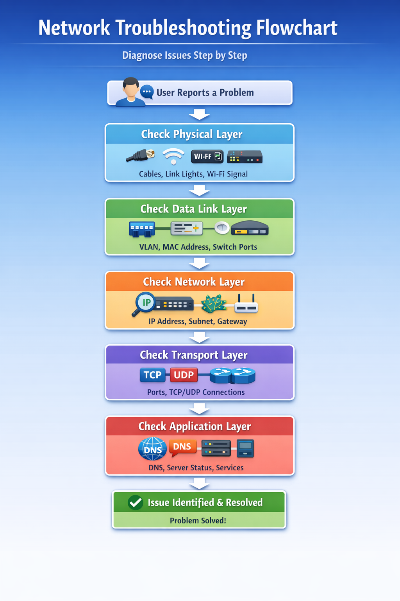

# 🔐 Topic 6: Network Services, Security, & Troubleshooting

> 📌 This topic explores how modern networks deliver services, defend against threats, and resolve connectivity issues efficiently.

- 📖 [Overview](Topic-6-Network-Services-Security-Troubleshooting/README.md)

---

## 📌 Overview

In this topic, I moved beyond basic network structure and began focusing on the services and security mechanisms that keep networks operational and protected.

While earlier topics explored how networks are built, this topic focused on:

- How devices receive IP addresses
- How domain names resolve to IP addresses
- How administrators troubleshoot connectivity
- How organizations protect infrastructure from cyber threats

This topic connects technical configuration with security awareness and real-world troubleshooting strategy.

---

## 🎯 Learning Objectives

- Identify core network infrastructure devices and their roles
- Understand common network services such as DHCP, DNS, and NTP
- Explore cybersecurity partnerships and defense frameworks
- Apply the OSI model to troubleshoot connectivity issues
- Use command-line tools to verify network health

---

## 🔄 Visual Troubleshooting Framework

The OSI model becomes most powerful when used as a structured diagnostic tool.

Instead of guessing where a failure occurs, I follow a layered approach that isolates the problem step by step.

This visual framework ensures that troubleshooting is systematic rather than reactive.

By starting at the Physical layer and working upward, issues can be identified efficiently without overlooking foundational problems.

---

## 🛡 Common Cybersecurity Threats

Understanding network services also means understanding how they can be attacked.

### 🔓 Phishing
Attackers trick users into revealing credentials through deceptive emails or websites.

### 🦠 Malware
Malicious software designed to damage systems or steal data.

### 🔐 Ransomware
Encrypts company data and demands payment for release.

### 🌐 Distributed Denial of Service (DDoS)
Overwhelms servers with traffic to disrupt service.

### 🔍 Man-in-the-Middle (MITM)
Intercepts communication between two devices to steal or alter information.

---

## 🧰 Defensive Measures

To protect network services:

- Firewalls filter traffic
- VPNs encrypt remote connections
- Antivirus software protects endpoints
- IDS/IPS systems monitor suspicious activity
- Regular patching reduces vulnerabilities

---

## 📚 Topic Sections

- 🧠 [Discussion Responses](Discussion-Responses.md)
- 🏢 [Equipment, Vendors, and Cybersecurity Partners](Equipment-Vendors-and-Partners.md)
- 🖥 [Packet Tracer Part 5 – Server Configuration](Packet-Tracer-Part-5-Server.md)

---

## 🔎 Why This Topic Matters

Network services are the invisible systems that allow everything to function smoothly. Without DHCP, devices cannot communicate properly. Without DNS, users cannot reach websites by name. Without security planning, organizations are vulnerable.

This topic helped me understand that networking is not just about cables and routers — it is about reliability, structure, and protection.

---

## 📘 Final Reflection

Topic 6 connected infrastructure, services, and security into one unified perspective.

It reinforced that networking is not just about connectivity — it is about reliability, protection, and structured problem-solving.

Understanding services like DHCP and DNS, combined with systematic troubleshooting, creates a strong foundation for secure network administration.

