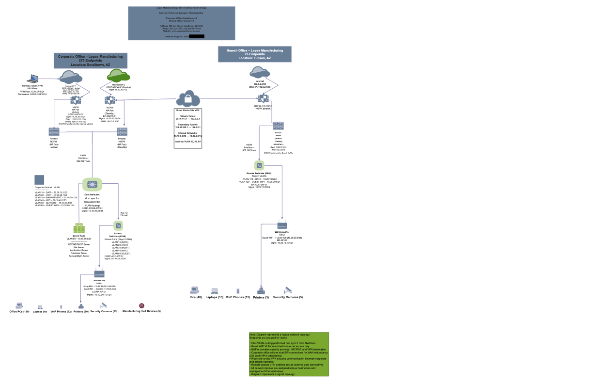

# 🗺 Network Diagram – Phase 3 (WAN Implementation)

---

## 📌 Project Overview

In Phase 3 of the network design project, I expanded the internal LAN design to include WAN connectivity, VPN solutions, public IP addressing, and proper device naming conventions.

This phase required building a scalable and fault-tolerant infrastructure for:

- Corporate Office (275 endpoints)
- Branch Office (75 endpoints)

---

## 🌐 WAN Design Elements Included

- Internet-based WAN connections at both sites
- Public IPv4 addresses in /30 notation
- Redundant connectivity at corporate
- Site-to-site VPN tunnel
- Remote user VPN
- Hostnames and management IP addresses
- VLAN segmentation from previous phases

---

## 🔐 VPN Implementation

Two VPN types were included:

### 1️⃣ Remote Access VPN
Allows employees to securely connect from home.

### 2️⃣ Site-to-Site VPN
Creates an encrypted tunnel between corporate and branch offices.

---

## 🖼 Final Logical Topology

---

## 💡 Why This Phase Matters

This phase demonstrated:

- WAN scalability
- Secure inter-site communication
- Public vs private IP planning
- Logical network mapping
- Fault tolerance planning

Designing WAN architecture requires thinking beyond a single building — it requires planning for growth and security.
