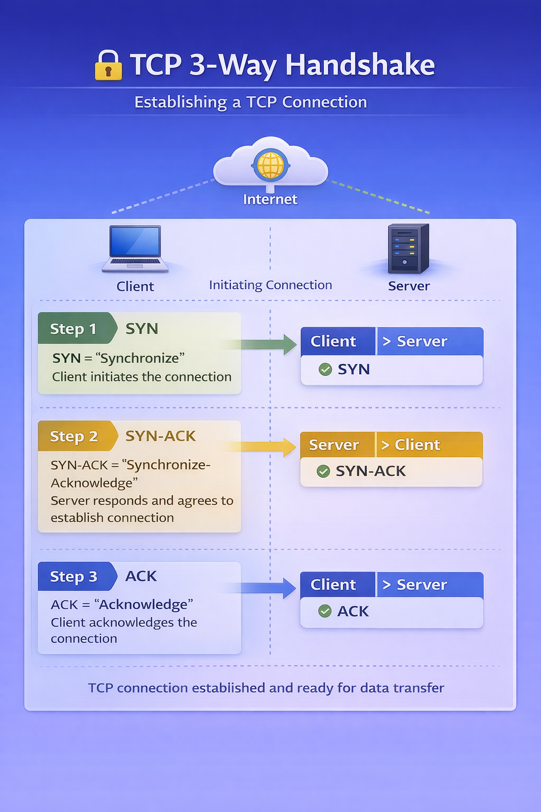

# 🖥 Packet Tracer Part 6: Routing & WAN Connectivity

---

## 📌 Lab Overview

In this final phase of implementation, the focus shifted to configuring the router — the core device responsible for connecting internal VLANs to external networks.

Since a firewall was not available, the router temporarily provided gateway and routing functionality.

---

## 🔧 Router-on-a-Stick Configuration

To allow multiple VLANs to communicate:

- Configured trunk port on the switch
- Created router subinterfaces for:
  - VLAN 2 (DATA)
  - VLAN 4 (MANAGEMENT)
  - VLAN 240 (GUEST_WIFI)
- Assigned appropriate IP addresses
- Enabled DHCP forwarding for guest network

This configuration allows inter-VLAN routing using a single physical interface.

---

## 🌐 External Interface Configuration

The router's internet-facing interface:

- Obtained IP address via DHCP
- Configured default route
- Enabled external communication

This allowed internal users to reach external internet resources.

---

## 🔎 Verification & Testing

To confirm routing worked:

- show ip route
- show running-config
- show ip interface brief
- ping external IP addresses
- Accessed websites through browser

---

## 📡 Tracking TCP Packets

Using Packet Tracer simulation mode, I observed:

1. TCP three-way handshake
   - SYN
   - SYN-ACK
   - ACK

2. Data transfer
3. Connection termination

Tracking packet flow reinforced understanding of how WAN traffic moves across networks.

---

## 🔐 TCP 3-Way Handshake (Connection Establishment)

Before any data is transferred across a WAN, a TCP session must first be established.

### Step 1 – SYN  
The client initiates communication by sending a SYN (synchronize) packet.

### Step 2 – SYN-ACK  
The server responds with a SYN-ACK, acknowledging the request and agreeing to establish communication.

### Step 3 – ACK  
The client sends an ACK, confirming the connection.

Once this three-step exchange is complete, the connection is established and data transfer can begin.

Understanding this process is critical when troubleshooting WAN connectivity and firewall behavior.

---

## 💡 Key Skills Reinforced

- VLAN trunking
- Subinterface configuration
- Static routing
- Default routes
- WAN connectivity
- TCP packet flow analysis
