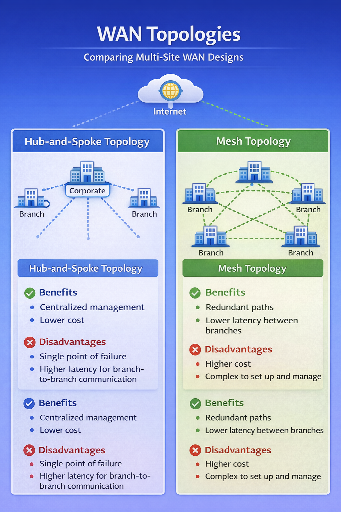

# 🌍 Topic 7: Wide Area Networking (WAN)

> 📌 This topic explores how networks extend beyond a single building, enabling communication between multiple locations across cities or even globally.

---

## 📌 Overview

In this topic, I shifted from internal LAN design to understanding how networks communicate across geographic distances.

Wide Area Networking (WAN) connects multiple LANs together, allowing corporate offices, branch locations, and remote users to securely exchange data over the internet or private connections.

This topic focused on:

- WAN topologies
- VPN functionality
- TCP packet flow
- Router-based routing
- Network mapping and scalability
- Real-world routing configuration

---

## 🎯 Learning Objectives

- Compare WAN topologies and their trade-offs  
- Understand VPN types and security implementations  
- Track packets in a TCP connection  
- Design scalable WAN-connected networks  
- Identify common WAN-enabled applications (HTTP, SMTP, VoIP, SSH)  

---

## 🌐 WAN Topologies Comparison

When connecting multiple locations, the chosen WAN topology directly impacts performance, cost, and fault tolerance.

### Hub-and-Spoke
- Centralized control
- Lower cost
- Easier to manage
- Single point of failure at the hub

### Mesh
- Multiple redundant paths
- Higher reliability
- Lower branch-to-branch latency
- More complex and expensive

---

## 📚 Topic Sections

- 🧠 [Discussion Responses](Discussion-Responses.md)
- 🗺 [Network Diagram – Phase 3](Network-Diagram-Phase-3.md)
- 🖥 [Packet Tracer Part 6 – Routing](Packet-Tracer-Part-6-Routing.md)

---

## 🧭 Big Idea of This Topic

If LAN design is about building a stable internal network, WAN design is about connecting that network to the world — securely, reliably, and efficiently.
